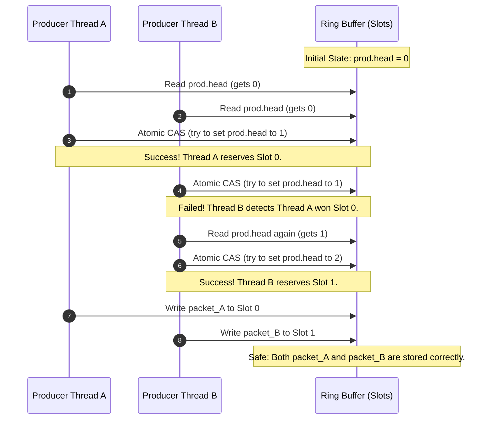
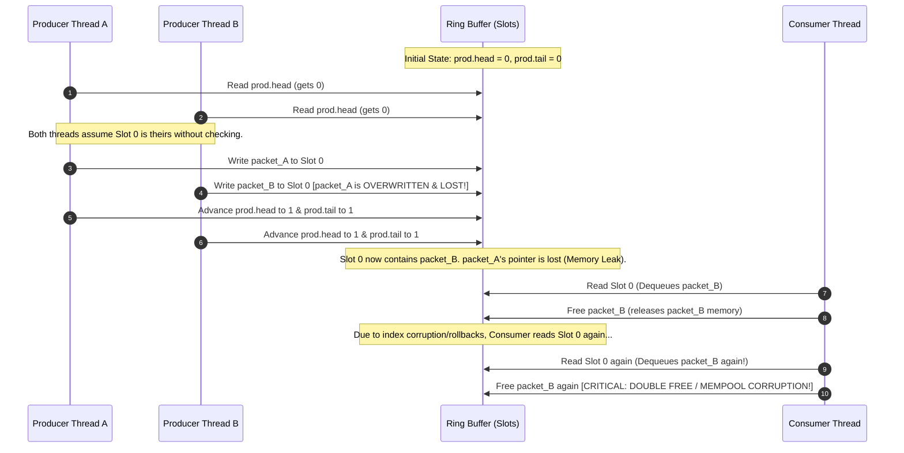

# DPDK Single Producer Ring Race Condition Demonstration

This sample application demonstrates the data race (Race Condition) that occurs when DPDK's Single-Producer (SP) ring enqueue API (`rte_ring_sp_enqueue_bulk()` / `rte_ring_sp_enqueue_burst()`) is concurrently called by multiple threads (workers) without proper serialization.

## Background & Mechanism

In network programming, DPDK's `rte_ring` is a high-speed queue used to pass packet references (`mbuf`) between CPU cores. To achieve maximum performance, it provides different synchronization modes:

- **Multi-Producer (MP)**: Safe for multiple threads to write concurrently. It uses lock-free atomic CAS (Compare-and-Swap) operations to serialize pointer reservations.
- **Single-Producer (SP)**: Fast, but **only one thread is allowed to write at a time**. It skips atomic checks to save CPU cycles.

If multiple threads call the SP enqueue API concurrently, they overwrite each other's data and corrupt index pointers, leading to memory leaks and memory contamination.

Here is a step-by-step comparison of how these modes behave.

### 1. Multi-Producer (MP) Mode - Correct & Safe Concurrent Writes

In MP mode, threads use atomic operations to safely reserve distinct slots. Thread B detects Thread A's atomic reservation and backs off to the next slot, preventing any overlap.



---

### 2. Single-Producer (SP) Mode - Race Condition & Memory Corruption

Without atomic synchronization, both threads assume Slot 0 is empty and write to the same space. This leads to packet loss and memory corruption.



---

### Key Consequences for Developers

- **Memory Leak (Packet Loss)**: When `packet_A` gets overwritten by `packet_B` in Slot 0, the program loses the reference pointer to `packet_A`. The memory block of `packet_A` remains allocated forever, causing physical memory exhaustion.
- **Double Free & Mempool Pollution**: When `packet_B` is read and freed twice, the memory allocator registers the same memory block twice to the list of "free chunks". If different threads allocate memory later, they might get assigned the exact same memory block, leading to random data corruption or application crashes.

## Reproduction Steps

### Requirements

- A Linux environment with DPDK installed and detectable via `pkg-config` (for `libdpdk`).
- At least 3 available CPU cores (1 consumer core, 2 or more producer cores).

### Build & Run

Run the script `run.sh` to automatically set up the build environment using Meson/Ninja and launch the application.

```bash
./run.sh
```

You can customize the execution by passing arguments in the following order:

```bash
./run.sh [CORES] [DURATION] [INTERVAL_US] [USE_MP] [BURST_SIZE]
```

#### Arguments
- `CORES` (default: `7`): Total CPU cores to run (1 consumer, others are producers).
- `DURATION` (default: `5`): Program duration in seconds.
- `INTERVAL_US` (default: `10`): Delay between producer allocations (in microseconds). To prevent mempool starvation due to fast memory leaks, the default is set to 10us.
- `USE_MP` (default: `false`): Set to `true` to switch to `rte_ring_mp_enqueue_bulk()` (Multi-Producer) to resolve the race condition.
- `BURST_SIZE` (default: `64`): Burst size for enqueuing and dequeuing (configured at build-time).

### Examples

#### 1. SP Mode (Reproduce the Issue)
Run with the default SP mode:
```bash
./run.sh 7 5 10 false 64
```
**Expected Output:**
```console
----------------------------------------
Starting dpdk-app (Ring Race Condition)
Cores: 7, Duration: 5s, Producer Interval: 10us
Build Option (use_mp): false
Build Option (burst_size): 64
----------------------------------------
...
--- DPDK Ring Race Reproduction ---
Mode: Single-Producer Ring Enqueue (rte_ring_sp_enqueue_bulk) [WARNING: Race condition expected]
...
[Consumer] ★★★ DUPLICATE ADDRESS IN SAME BURST: 0x13fd3f040 ... ★★★
[Consumer] ★★★ DUPLICATE SEQUENCE DETECTED (STALE DEQUEUE): ... ★★★
...
[Final Check] avail=1, size=8192, total_duplicates=267245
  Verdict: ★ DUPLICATE DETECTED (Confirmed via Ring Race Condition) ★
```
Thousands of duplicate packet references will be detected due to the race condition on the single-producer enqueue pointers.

#### 2. MP Mode (Resolve the Issue)
Run with the safe Multi-Producer mode:
```bash
./run.sh 7 5 10 true 64
```
**Expected Output:**
```console
----------------------------------------
Starting dpdk-app (Ring Race Condition)
Cores: 7, Duration: 5s, Producer Interval: 10us
Build Option (use_mp): true
Build Option (burst_size): 64
----------------------------------------
...
--- DPDK Ring Race Reproduction ---
Mode: Multi-Producer Ring Enqueue (rte_ring_mp_enqueue_bulk)
...
[Final Check] avail=0, size=8192, total_duplicates=0
  Verdict: ✓ OK or minor leakage (No race detected)
```
No duplicate addresses are detected because the CAS synchronization in the MP enqueue API prevents the race condition.
